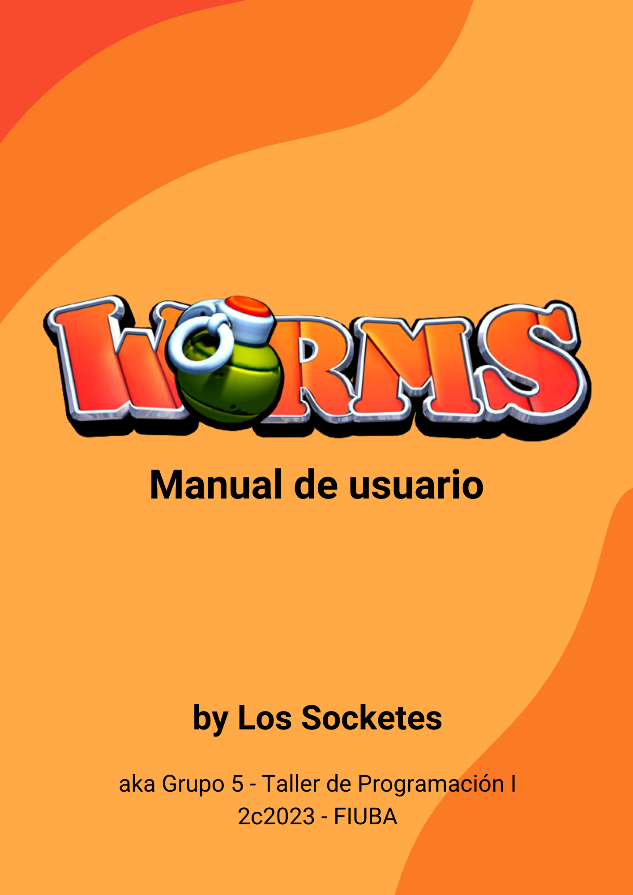
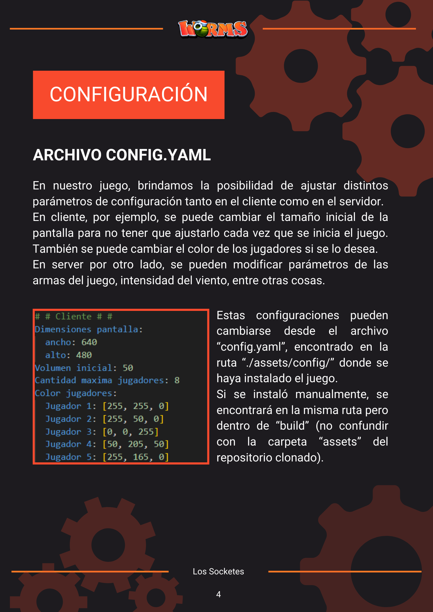
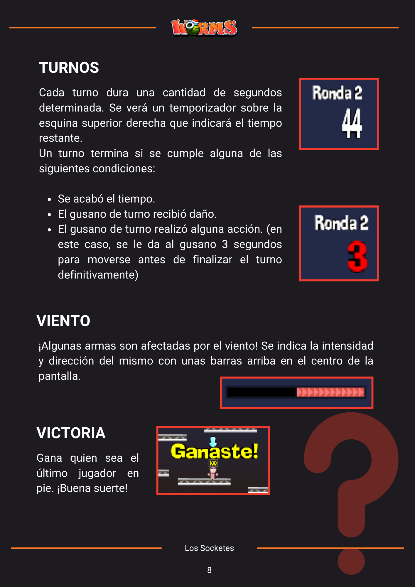
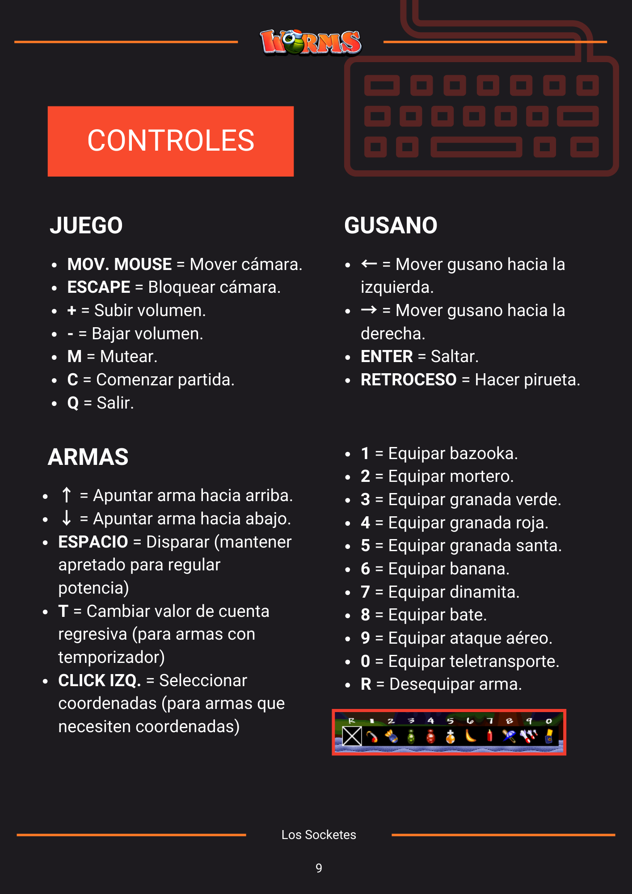
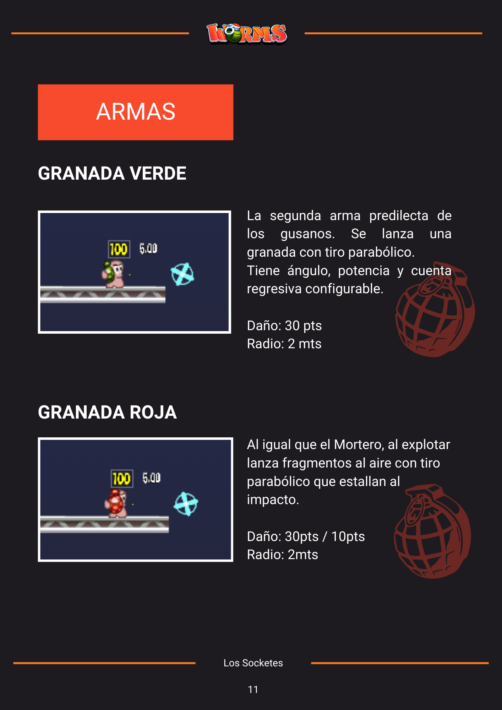
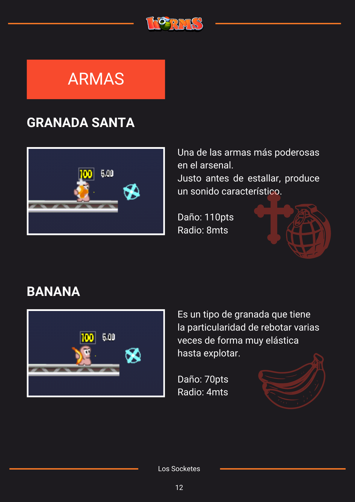
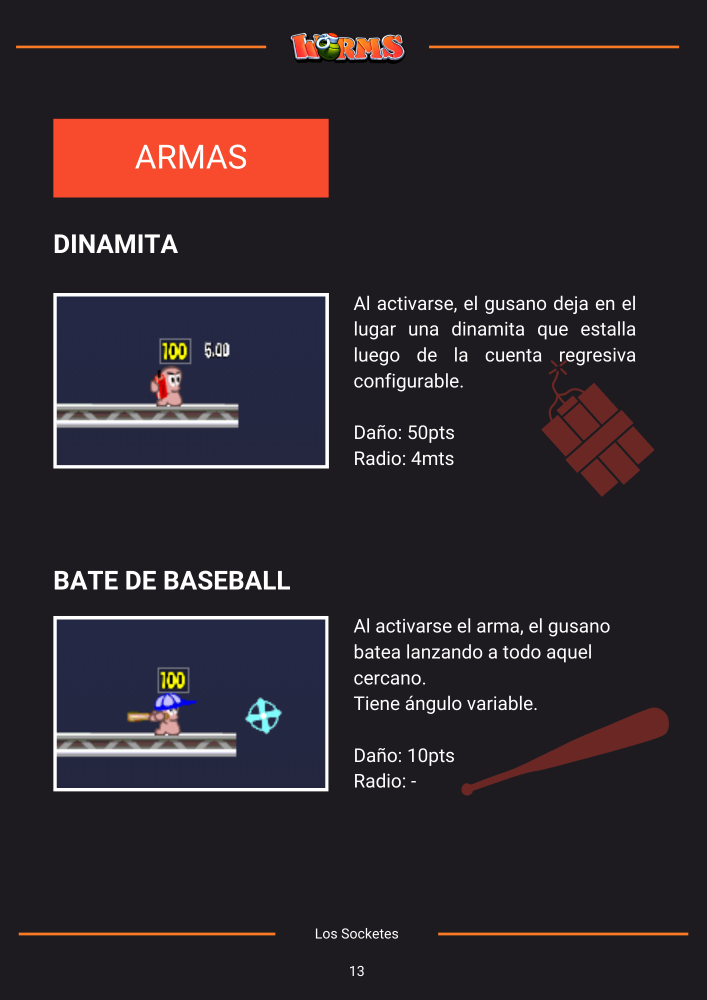

# Worms - Grupo 5














## Instrucciones de instalación:

### Requisitos previos

Instalación de librerías necesarias para la ejecución del programa:

```bash	
sudo apt-update
sudo apt-get install libjpeg-dev libpng-dev libfreetype-dev libopusfile-dev libflac-dev libxmp-dev libfluidsynth-dev libwavpack-dev cmake libmodplug-dev libsdl2-dev qtbase5-dev
```

#### Instalación de SDL2

```bash
git clone git@github.com:libsdl-org/SDL.git --branch release-2.26.5
cd SDL
mkdir build
cd build
cmake ..
make -j4
sudo make install
cd ../..
```

#### Instalación de SDL2_image

```bash
git clone git@github.com:libsdl-org/SDL_image.git --branch SDL2
cd SDL_image
mkdir build
cd build
cmake ..
make -j4
sudo make install
cd ../..
```

#### Instalación de SDL2_mixer

```bash
git clone git@github.com:libsdl-org/SDL_mixer.git --branch SDL2
cd SDL_mixer
mkdir build
cd build
cmake ..
make -j4
sudo make install
cd ../..
```

#### Instalación de SDL2_ttf

```bash
git clone git@github.com:libsdl-org/SDL_ttf.git --branch SDL2
cd SDL_ttf
mkdir build
cd build
cmake ..
make -j4
sudo make install
cd ../..
```

#### Instalación de libSDL2pp

```bash
git clone git@github.com:libSDL2pp/libSDL2pp.git --branch 0.18.1
cd libSDL2pp
mkdir build
cd build
cmake ..
make -j4
sudo make install
cd ../..
```

#### Instalación de box2d

```bash
git clone git@github.com:erincatto/box2d.git
cd box2d
mkdir build
cd build
cmake ..
make -j4
sudo make install
cd ../..
```

#### Instalación de yaml-cpp

```bash
git clone git@github.com:jbeder/yaml-cpp.git
cd yaml-cpp
mkdir build
cd build
cmake ..
make -j4
sudo make install
cd ../..
```

#### Instalación de catch2

```bash
git clone git@github.com:catchorg/Catch2.git
cd Catch2
mkdir build
cd build
cmake ..
make -j4
sudo make install
cd ../..
```

### Instalación del juego

```bash
git clone git@github.com:Los-Socketes/Worms.git
cd Worms
mkdir build
cd build
cmake --build . -j $(($(nproc) - 1))
```

## Ejecución del juego

Sobre la carpeta build:

Ejecutar el servidor:

```bash
./server <puerto>
```

Ejecutar el cliente:

```bash
./client <ip> <puerto>
```

## Controles

### Servidor

El servidor corre hasta que se envía la tecla 'q' por consola.

### Cliente

#### Menú principal

Cuenta con tres opciones: crear partida, unirse a partida y salir.

- Crear partida: se selecciona un mapa y se crea la partida.
- Unirse a partida: se selecciona el id de la partida y se une a la misma.
- Salir: se cierra el juego.

#### Partida

- Flechas izquierda y derecha: mueven al gusano controlado.
- Flechas arriba y abajo: apuntan el arma del gusano controlado (si tiene ángulo de tiro).
- Barra espaciadora: dispara el arma del gusano controlado o ejecuta la acción del arma.
- Tecla ENTER: salto del gusano controlado.
- Tecla BACKSPACE: salto hacia atrás del gusano controlado (pirueta).
- Teclas del '0' al '9': seleccionan el arma del gusano controlado.
- Tecla 'R': desequipa el arma del gusano controlado.
- Tecla 'T': cambia el temporizador del arma del gusano controlado (si tiene temporizador).

- Movimiento del mouse: mueve la cámara.
- Click izquierdo del mouse: selecciona un lugar del mapa para aquellas armas que requieran coordenadas.
- Tecla ESCAPE: bloquea la cámara.

- Tecla '+': aumenta el volumen del juego.
- Tecla '-': disminuye el volumen del juego.
- Tecla 'M': silencia el juego.

- Tecla 'Q': sale de la partida y cierra el juego.


