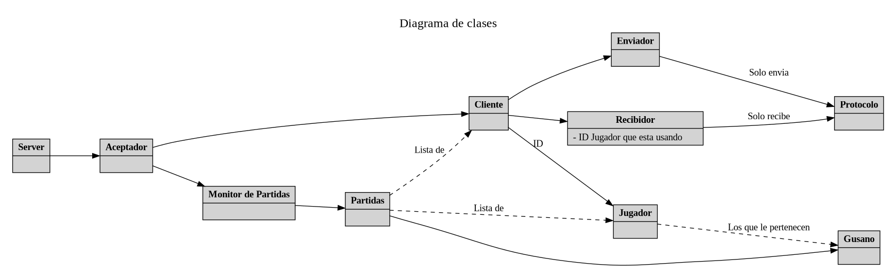

# Cliente

# Protocolo
El protocolo tiene dos tipos de mensajes, los de envío y los de obtención de información. Para ambos la estructura es similar, pero en lo que se diferencian es en que devuelven.\
Los de envío, que comienzan en su mayoría con "enviar" en caso de éxito devuelven true, mientras que en caso de fallar devuelven false. Estos mensajes comienzan enviando un código en base al tipo de mensaje. Internamente, comienzan con un código para identificar el tipo de información a enviar y luego el contenido en un formato específico. Cada tipo de dato se envía siguiendo un formato, siendo este el siguiente:
- Bools, códigos y enums: int8_t. Para los códigos existen métodos genéricos para enviarlos y recibirlos
- Vectores: primero se envía la cantidad de valores a leer y luego cada valor/ conjunto de valores que forme el elemento del vector.
- Floats: se convierten en ints con la función toInt() y se vuelven floats con toFloat(). Ademas, como se envían en int32_t es necesario el uso de htonl y ntohl para poder obtenerlos correctamente.
- Ids: se envían con int32_t, pero también existen métodos para simplificar ese paso.
- Pair: se preparan los valores en un vector y se envían, en caso de ser coordenadas, primero x y luego y.

Por otro lado, para obtener los mensajes se van obteniendo haciendo el proceso inverso a enviar los datos y se almacenan en un struct en base a la firma del método. En caso de que en algún momento falle el método y no consiga obtener toda la información, se devuelve un struct/ valor que es conocido como inválido. Para los ids existe INVAL_ID, para enums que definen el tipo de acción a realizar se agrego un valor que sea INVAL_* para poder diferenciarlos.\
El único método distinto es el de obtenerAccion, ya que es el que debe recibir todos los tipos de acción que el cliente/ jugador le envíe. Por esta misma razón, es necesario contemplar varios códigos validos ya que en esta implementación, los distintos tipos de acción tienen distinto código para que los mensajes sean lo mas cortos posibles y de esta forma la información se transmita eficientemente.

# Server
El server contiene una clase "Server" que inicia al aceptador y espera a que se escriba por la terminal "q" para cerrar el programa. Cada una de estas partidas se corre en un hilo propio. El conjunto de las partidas es manejado a través de un "Manejador de Partidas"; este se encarga de que crear nuevas partidas y destruir el hilo/ partida si la partida finalizó.\
Cada partida de worms es manejada por una clase "Partida". Esta corre un método principal llamada "game loop" (en realidad, el método se llama "run", pero a través de macros se lo renombro para que fuese algo mas representativo). Cada persona que se conecta a una partida es asignada una clase Cliente, la cual tiene una clase Reciever y Sender. Estas ultimas son las que usa la partida para recibir y enviar información en el struct de "EstadoDelJuego".\
Cada partida tiene además un conjunto de Jugadores y Gusanos (los jugadores tienen gusanos asociados para saber su estado en la partida). El gusano de turno actual realiza acciones que le llegan a través de una cola de acciones. Dicha cola recibe las acciones a través de los recievers de cada cliente.\
Los gusanos interactúan fundamentalmente con la clase Arma. Esta es una clase genérica que encapsula el comportamiento de todas las armas la cual cambia sus parámetros dependiendo del arma elegida. La partida accede a dicha arma para determinar que tipo de disparo/ataque realizo el gusano y características de cada arma.

## Clases implementadas
- Server: Inicia el programa y espera una "q" para terminar.
- Monitor de partida: Encargado de manejar todas las partidas vivas. Cuando una de estas termina, este se encarga de destruirla.
- Partida: Encapsula toda la logica del juego. Clase principal de la parte del server. Esta se encarga de hacer que los gusanos ejecuten sus acciones, maneja los turnos y posee toda la logica de box2d.
- Cliente: Representa un usuario conectado al servidor. Posee las clases sender y reciever.
- Sender: Clase que se encarga de enviar el estado del juego a traves del protocolo.
- Reciever: Clase que se encarga de recibir las acciones y enviarselas a la partida. Esta se encarga de incluir el ID del jugador al que representa. 
- Jugador: Representa el jugador de un cliente. Este tiene una lista de sus gusanso y se encarga de saber a que gusano le toca moverse.
- Gusano: Clase que ejecuta las acciones recibidas. Tiene la logica de qué proyectiles crear dada una accion.
- Configuración server: Clase que lee el yaml y actualiza los valores de las constantes usadas. No tiene ningún tipo de lógica del juego.
- Aceptador: Encargado de aceptar conexiones mediante un socket aceptador. Este se encarga de crear clientes y destuirlo en caso de que se pierda la conexión.
- Provision: Clase que se encarga de la lógica de las provisiones
- Arma: Clase genérica que encapsula el comportamiento de todas las armas. Cambia sus parámetros dependiendo del arma elegida. 
- Mapa: Clase que se encarga de la logica del mapa. 

# Cliente
El cliente se dividió en 4 hilos. El primero es el hilo principal, el cual se encarga de ejecutar el menú. Una vez que se conecta a una partida, inicializa los otros 3 hilos y ejecuta el loop principal del juego. El loop principal del juego llama a un control de entidades, el cual se encarga de actualizar las entidades del juego y dibujarlas en pantalla. Cada entidad controla sus iteraciones y conoce a los gestores de animaciones y sonidos, que funcionan como librerías de punteros a esos recursos. El loop principal además recibe eventos de SDL a traves de una cola no bloqueante para comandos internos del cliente, como por ejemplo cerrar el juego. El loop está implementado como un "constant rate loop" para que las animaciones no se vean afectadas por la velocidad de procesamiento del cliente.\
El segundo hilo es el encargado de recibir los estados de juego desde el servidor. Este pushea los estados a una cola de estados, la cual es compartida con el hilo principal. El hilo principal hace un pop no bloqueante de la cola de estados, y en caso de que haya un estado disponible, lo procesa y lo muestra en pantalla. Si no hay estados disponibles, se sigue mostrando el último estado recibido y se inicia un timer para que en caso de que no se reciban estados en un tiempo determinado, se desconecte al cliente.\
El tercer hilo es el encargado de enviar las acciones del cliente al servidor. Este hilo recibe las acciones desde una cola compartida con el cuarto hilo. Estas acciones son polimórficas, cada una conoce a qué método del protocolo debe llamar para enviarse a sí misma.\
Por último, el cuarto hilo es el encargado de recibir los eventos de SDL y convertirlos en acciones o comandos internos. Este hilo conoce dos colas, una de acciones y otra de comandos. La primera le permite la comunicación con el hilo de envío de acciones, y la segunda con el hilo principal.

## Clases implementadas
- Cliente: Clase principal del cliente. Se encarga de inicializar los hilos y ejecutar el loop principal del juego.
- Control de entidades: Clase que se encarga de actualizar las entidades del juego y decirles que se dibujen en pantalla.
- Entidad: Clase abstracta que representa una entidad del juego. Sus subclases conocen cómo dibujarse en pantalla y cómo actualizarse.
- Gestor de animaciones: Clase que se encarga de cargar y devolver punteros a las animaciones del juego.
- Gestor de sonidos: Clase que se encarga de cargar y devolver punteros a los sonidos del juego.
- Animación: Clase que representa una animación del juego. Conoce el recurso aplicado como textura de SDL y se encarga de dibujar el frame correspondiente según la iteración actual.
- Sonido: Clase que representa un sonido del juego. Conoce el recurso aplicado como sonido de SDL y se encarga de reproducirlo.
- Recibidor: Hilo encargado de recibir los estados de juego desde el servidor.
- Enviador: Hilo encargado de enviar las acciones del cliente al servidor.
- EntradaTeclado: Hilo encargado de recibir los eventos de SDL y convertirlos en acciones o comandos internos.
- AcciónCliente: Clase abstracta que representa una acción del cliente. Sus subclases conocen a qué método del protocolo deben llamar para enviarse a sí mismas.
- Cámara: Clase que representa la cámara del juego. A través de su posición y dimensiones, sabe qué parte del mapa debe dibujarse en pantalla. Conoce la posición del objetivo a seguir, y se mueve hacia él si no hubo un movimiento del mouse para controlarla en un tiempo determinado.
- Menú: Clase que representa el menú del juego. Es lo primero en iniciarse y establecer una conexión con el servidor. A través de el se determina si se está creando una partida o uniéndose a una existente.

Una aproximación de la estructura de clases del cliente se puede ver en el siguiente diagrama:

